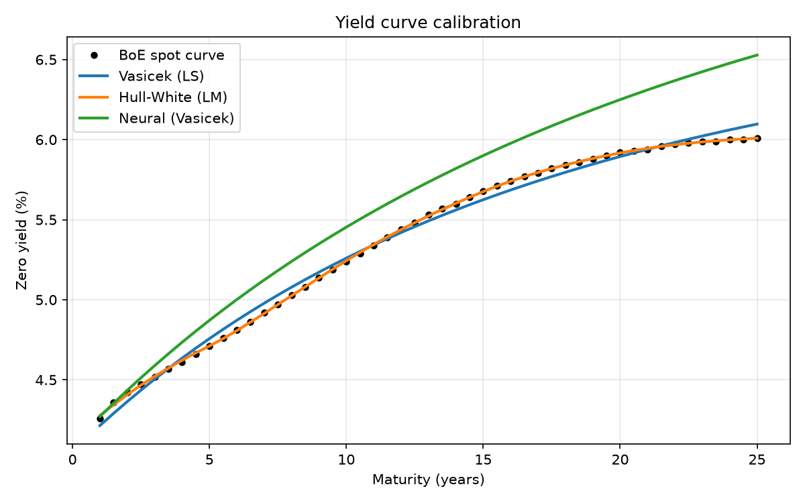

# Yield Curve Calibration: Classical vs Neural

How much of a real yield curve can a short-rate model explain, how fast can you
calibrate it, and where does a neural network help?

Three approaches calibrated to the same Bank of England gilt spot curve
(2 September 2026, 1–25 year maturities): Vasicek by least squares, Hull-White
with a piecewise-constant drift, and a neural network trained to calibrate in a
single forward pass (after Hernandez, 2016).



## Results

| Method | RMSE (bps) | Calibration time | Notes |
|---|---|---|---|
| Vasicek (least squares) | 4.38 | ~6 ms | One-factor model; can't bend twice |
| Hull-White (least squares) | 0.53 | ~40 ms | Time-varying drift absorbs the curve shape |
| Neural network (Vasicek) | 27.1 | ~0.05 ms | ~100× faster, but coarse |
| Hybrid (NN warm start → LS) | 3.54 | ~25 ms | Converges to a different point in the same flat valley |

## What I found

**A single yield curve can't identify a Vasicek model.** The curve pins down a
level and a slope, but the model has four parameters. Volatility `σ` collapsed
to zero under unconstrained optimisation because it only enters the yield
through a small convexity term. Mean-reversion speed `a` and long-run level `b`
trade off along a flat valley: `(a=0.106, b=0.072)` and `(a=0.020, b=0.200)`
fit the curve to within a basis point of each other. This is why practitioners
fix `a` and `σ` from option prices and let the curve determine only what it can.

**Hull-White fixes the fit, not the identifiability.** Holding `a` and `σ`
fixed and letting the drift `θ(t)` vary in six piecewise-constant segments
brings the error from 4.4 to 0.5 bps. The fitted `θ` peaks on the 5–10 year
segment and declines after, matching where the market curve steepens then
flattens. Piecewise-constant `θ` is interpretable but jagged; a smooth
parametrisation would trade readability for stability.

**Neural calibration is fast and brittle.** Trained on 200,000 simulated
Vasicek curves, the network calibrates in ~0.05 ms. But the real curve is not
exactly Vasicek-shaped, and on first attempt the network extrapolated off its
training manifold and returned a negative `a`. Adding 5 bps of Gaussian noise
to the training curves, and clipping outputs to the training range, made it
return the nearest sensible parameters instead. Its practical role is as a
warm start for the classical optimiser, not a replacement.

## Implementation notes

- Bond prices under Vasicek use the closed form. Hull-White integrates `θ(t)`
  numerically on a 0.01-year grid so that any drift parametrisation can be
  swapped in without re-deriving; verified against the Vasicek closed form in
  the constant-`θ` limit (agreement to 4e-8).
- Calibration fits yields rather than prices so that every maturity is weighted
  equally and errors are in basis points.
- Optimisation uses `scipy.optimize.least_squares`. For Vasicek, `a` is
  optimised in log space and all parameters are bounded, which closes the
  degenerate corners (`a → 0`, `b → ∞`) an unconstrained fit wanders into;
  this uses the bounded trust-region method (`trf`). Hull-White, with `a` and
  `σ` fixed, uses unbounded Levenberg-Marquardt.
- The neural calibrator is a 2-hidden-layer MLP (128 units) in PyTorch,
  trained with Adam and a cosine learning-rate schedule.

## Run

```
pip install -r requirements.txt
python main.py
```

Loads `data/yield_curve.csv`, calibrates all models, trains the network
(a few minutes on CPU), and writes `results/results.csv` and `results/fit.png`.

## Data

Bank of England nominal government liability (gilt) spot curve, 2 September
2026, maturities 1 to 25 years. Source: bankofengland.co.uk, Statistics,
Yield curves.

## Extensions

- Fix `a` in the Vasicek fit to make the problem well-posed and re-test whether
  the network and least squares then agree.
- Calibrate `a` and `σ` to swaption or cap prices rather than the curve.
- Replace piecewise-constant `θ(t)` with a smooth (e.g. Nelson-Siegel-style)
  parametrisation and compare stability across dates.

## References

Hernandez, A. (2016). *Model Calibration with Neural Networks*. SSRN 2812140.
Hull, J. and White, A. (1990). Pricing interest-rate-derivative securities.
*Review of Financial Studies*, 3(4).